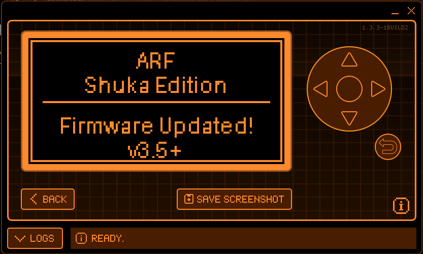
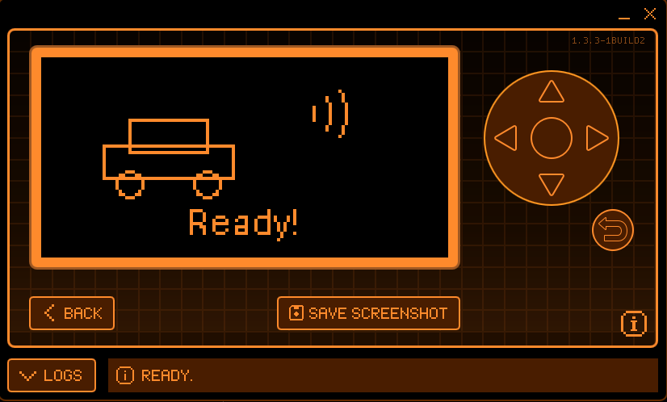
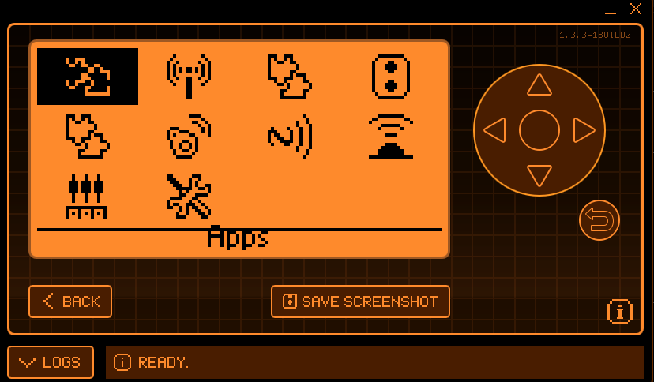
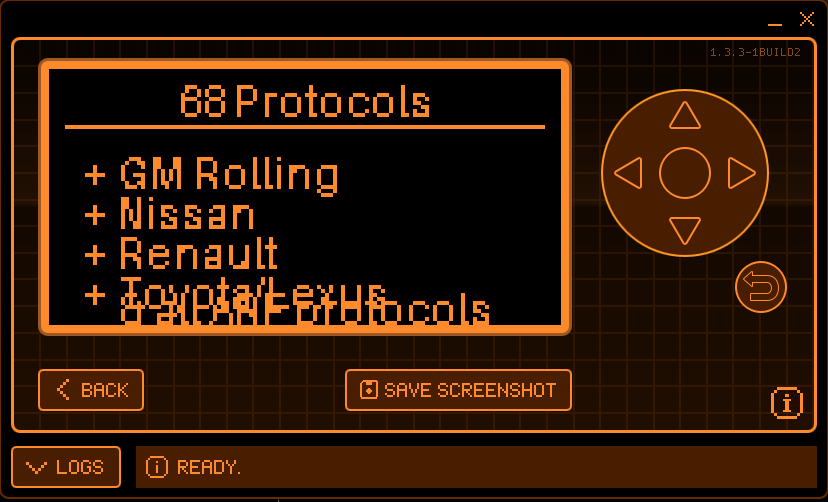
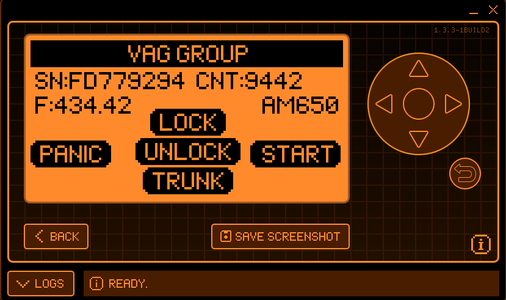
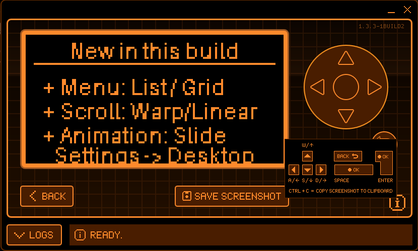

# [Don't forget to star this repo]

# Flipper-ARF-Shuka-Edition

Custom Flipper Zero firmware by **shuka0158**, built on top of [D4C1-Labs/Flipper-ARF](https://github.com/D4C1-Labs/Flipper-ARF).

[This project is made only for educational purposes!]

[](https://github.com/shuka0158/ARF-Shuka-Edition/actions/workflows/build.yml)
[](https://github.com/shuka0158/ARF-Shuka-Edition/actions/workflows/auto-update.yml)

---

## Screenshots

| Boot splash | Idle animation | Icon grid menu |
|:---:|:---:|:---:|
|  |  |  |

| 88 protocols (4 added) | VAG decoded signal | New build features |
|:---:|:---:|:---:|
|  |  |  |

| Signal Idle animation |
|:---:|
|  |

---

## What this adds beyond ARF

ARF-Shuka-Edition is identical to upstream ARF plus **6 automotive protocols** that ARF does not have:

| Protocol | Brand coverage | Encoding | Frame |
|---|---|---|---|
| **GM Rolling** | Chevrolet, GMC, Buick, Cadillac (2000–2015) | Manchester | 64-bit, XOR checksum |
| **Honda/Acura** | Honda Civic, CR-V, Accord (2007+) / Acura TL, MDX, RDX | PWM | 64-bit, CRC-8 0x2F |
| **Hyundai New** | Hyundai all models (2017+), Genesis all models | PWM | 64-bit, CRC-8 0x31 |
| **Nissan** | Nissan, Infiniti (2003–2018) | PWM | 64-bit, CRC-8 0x97 |
| **Renault** | Renault, Dacia — Clio/Megane/Duster (2005–2020) | PCM biphase | 64-bit, XOR checksum |
| **Toyota/Lexus** | Corolla, Camry, RAV4, Hilux, Land Cruiser, Lexus IS/RX/GS (2003–2020) | PWM | 72-bit, CRC-8 0xEA |

> ARF already has a `toyota.c` covering older Corolla Verso (2004–2010) and Tundra (2011) variants.
> Our `toyota_lexus.c` covers a different, newer frame format — both coexist in this firmware.
>
> Older Hyundai models (pre-2017) are already covered by the KIA V0–V7 variants already in ARF.

Everything else — all 64 ARF protocols, the automotive scanner, car-key emulator, custom button support, Keeloq extensions, AES/AUT64/TEA crypto — is unchanged from ARF upstream.

Custom branded boot splash is shown on first boot and after firmware updates.

### 4 custom idle animations (no SD card required)

Embedded directly into the firmware update bundle — no SD card copy-paste needed. After flashing, the Flipper shows these on the idle desktop:


### Menu appearance settings

Go to **Settings → Desktop** to configure:

- **Scroll Style** — Linear (stops at ends) or Warp (wraps around to first/last)
- **Scroll Animation** — Instant jump or smooth slide between items
- **Menu Layout** — Classic list or Icon Grid (4 columns × 3 rows)

### Auto-sync with upstream ARF

A GitHub Actions bot checks for new ARF releases every 6 hours. When a new build is detected, it automatically rebuilds ARF-Shuka-Edition on top of it and publishes a new release — tagged with the upstream ARF build it is based on.

---

## Full protocol list (67 total)

### Automotive RKE (our 6 additions marked ★)

| Brand | Protocol(s) |
|---|---|
| BMW | CAS4 |
| Chrysler / Dodge / Jeep | Chrysler |
| Fiat / Alfa / Lancia | Fiat Marelli, Fiat SPA |
| Ford / Lincoln | Ford V0, V1, V2, V3 |
| ★ GM / Chevrolet / Buick / Cadillac | GM Rolling |
| ★ Honda / Acura | Honda/Acura (2007+) |
| Hyundai / Kia | KIA V0, V1, V2, V3/V4, V5, V6, V7, ★ Hyundai New (2017+) |
| Land Rover | Land Rover V0 |
| Mazda | Mazda V0, Mazda Siemens |
| Mitsubishi | Mitsubishi V0 |
| ★ Nissan / Infiniti | Nissan |
| Porsche | Porsche Cayenne |
| PSA / Peugeot / Citroën | PSA V1, PSA V2 |
| ★ Renault / Dacia | Renault |
| Subaru | Subaru |
| Suzuki | Suzuki |
| Toyota / Lexus | Toyota (Verso/Tundra), ★ Toyota/Lexus 2003–2020 |
| VAG / VW / Audi / Seat / Skoda | VAG Group |

### Gates, barriers, garage doors (from ARF)

Alutech AT-4N · Beninca Arc · CAME · CAME Atomo · CAME Twee · Chamberlain · Dickert MAHS · Doitrand · FAAC SLH · Gangqi · Gate TX · Hay21 · Holtek · Holtek HT12X · Hormann · Keyfinder · KingGates Stylo 4K · Linear · Linear Delta 3 · Marantec · Marantec24 · Mastercode · Megacode · Nice Flo · Nice Flor-S · Phoenix V2 · Princeton · Revers RB2 · Roger · Security+ V1 · Security+ V2 · SMC5326 · Somfy Keytis · Somfy Telis · Keeloq (generic)

### Utility

RAW · BIN RAW

---

## Quick start

### Web flasher (easiest — Chrome/Edge only)

1. Open **[shuka0158.github.io/ARF-Shuka-Edition/flash.html](https://shuka0158.github.io/ARF-Shuka-Edition/flash.html)** in Chrome or Edge
2. Plug in your Flipper via USB
3. Click **Connect & Flash** — done

The web flasher downloads the latest bundle and installs it over USB using the Flipper RPC protocol. No qFlipper or file downloads required. Firefox is not supported (no WebSerial).

---

### Recommended — full install (firmware + apps)

1. Go to [Releases](../../releases) and download **`flipper-z-f7-update-arf-shuka-edition.tgz`**
2. Open **qFlipper → Install from file** → select the `.tgz`
3. Done — firmware and all apps are updated in one step

### Firmware only (no SD card changes)

Download **`flipper-z-f7-full-arf-shuka-edition.dfu`** instead and install the same way.
Use this if you just want to update the firmware binary without touching your SD card.

### What's in each release file

| File | What it does |
|---|---|
| `flipper-z-f7-update-arf-shuka-edition.tgz` | **Full install** — firmware + Infrared, NFC, RFID, GPIO, Bad USB, U2F apps |
| `flipper-z-f7-full-arf-shuka-edition.dfu` | Firmware binary only |
| `ARF-Shuka-animations.zip` | Custom idle animations — copy to SD card manually if you want them |

---

## Recovery (If Flipper is not responding / bricked)

If your Flipper won't boot, isn't detected by qFlipper or `dfu-util`, and normal button combos don't work, use this sequence to force the STM32 hardware boot ROM into recovery mode — **no tools or case opening required**.

**Exact sequence:**

1. **Unplug** USB completely
2. **Hold BACK for 30 seconds** — forces a hardware-level reset
3. **Hold BACK + LEFT for 3 seconds** — triggers a soft reboot
4. **Hold BACK + OK for 35 seconds** — keep holding both for the full 35 s
5. At 35 s, **release BACK** but **keep holding OK**
6. While still holding OK, **plug in USB**
7. Wait a few seconds, then open **qFlipper**
8. Flipper appears in **Recovery Mode** — hit **Repair Firmware**

> This forces the STM32 into bootloader recovery via the hardware boot ROM, bypassing any broken firmware or bootloader code entirely.

---

## Build from source

```bash
git clone --depth 1 https://github.com/D4C1-Labs/Flipper-ARF.git
cd Flipper-ARF
git submodule update --init --recursive --depth 1

# Add our 6 protocols
cp /path/to/ARF-Shuka-Edition/new_files/gm_rolling.{c,h}    lib/subghz/protocols/
cp /path/to/ARF-Shuka-Edition/new_files/honda_acura.{c,h}   lib/subghz/protocols/
cp /path/to/ARF-Shuka-Edition/new_files/hyundai_new.{c,h}   lib/subghz/protocols/
cp /path/to/ARF-Shuka-Edition/new_files/nissan.{c,h}         lib/subghz/protocols/
cp /path/to/ARF-Shuka-Edition/new_files/renault.{c,h}        lib/subghz/protocols/
cp /path/to/ARF-Shuka-Edition/new_files/toyota_lexus.{c,h}   lib/subghz/protocols/

# Register them in the protocol list
sed -i 's|#include "toyota.h"|#include "toyota.h"\n#include "gm_rolling.h"\n#include "honda_acura.h"\n#include "hyundai_new.h"\n#include "nissan.h"\n#include "renault.h"\n#include "toyota_lexus.h"|' lib/subghz/protocols/protocol_items.h
sed -i '/subghz_protocol_toyota,$/a\    \&subghz_protocol_toyota_lexus,\n    \&subghz_protocol_gm_rolling,\n    \&subghz_protocol_honda_acura,\n    \&subghz_protocol_hyundai_new,\n    \&subghz_protocol_nissan,\n    \&subghz_protocol_renault,' lib/subghz/protocols/protocol_items.c

./fbt COMPACT=1 DEBUG=0 DIST_SUFFIX="arf-shuka-edition" updater_package
```

CI does this automatically on every push — see [`.github/workflows/build.yml`](.github/workflows/build.yml).

---

## Size

| Firmware | Size | Margin |
|---|---|---|
| ARF upstream | ~855 KB | ~5 KB |
| ARF-Shuka-Edition | ~860 KB | ~0 KB |

The STM32WB55 C2 (Bluetooth coprocessor) flash boundary sits at **860 KB** (0x080D7000). CI enforces this limit — the build fails automatically if the firmware exceeds it.

---

## Disclaimer

This project is provided solely for **educational, research, and interoperability purposes**.

ARF-Shuka-Edition is an independently maintained firmware build for studying and experimenting with automotive and embedded systems. It supports academic research, security experimentation, and exploration of vehicle technologies in a responsible and ethical manner.

This project builds upon [D4C1-Labs/Flipper-ARF](https://github.com/D4C1-Labs/Flipper-ARF) and [flipperdevices/flipperzero-firmware](https://github.com/flipperdevices/flipperzero-firmware), following their respective licenses. All included code remains under its original license terms.

The maintainers and contributors of this project **do not support, promote, or enable any illegal activity**, including unauthorized access to devices, vehicles, systems, infrastructure, or other property.

By accessing, using, modifying, compiling, or distributing this software, you agree that:

- You are fully responsible for your use of this code.
- You will follow all relevant local, national, and international laws.
- You will use this software **only for lawful, ethical, and research purposes**.
- You will not use this software to harm others, breach security, or compromise property without explicit permission.

The authors, maintainers, and contributors **bear no responsibility or liability** for any misuse, damages, legal consequences, or violations resulting from the use, modification, or distribution of this code.

THIS SOFTWARE IS PROVIDED **"AS IS,"** WITHOUT ANY WARRANTIES OF ANY KIND. IN NO EVENT SHALL THE AUTHORS OR CONTRIBUTORS BE LIABLE FOR ANY CLAIM, DAMAGES, OR OTHER LIABILITY ARISING FROM THE USE OF THIS SOFTWARE. **ALL RISKS REMAIN WITH THE USER.**

---

## License

GPL-3.0 — inherited from [D4C1-Labs/Flipper-ARF](https://github.com/D4C1-Labs/Flipper-ARF) and [flipperdevices/flipperzero-firmware](https://github.com/flipperdevices/flipperzero-firmware).

Huge thanks to D4C1-Labs for creating such interesting project ("Flipper-ARF")
