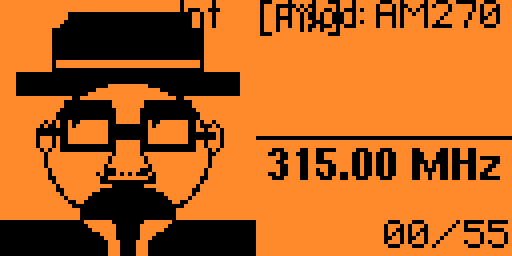

# [Don't forget to star this repo]

# ARF-Shuka-Edition

Custom Flipper Zero firmware by **shuka0158**, built on top of [D4C1-Labs/Flipper-ARF](https://github.com/D4C1-Labs/Flipper-ARF).

[This project is made only for educational purposes!]

[](https://github.com/shuka0158/ARF-Shuka-Edition/actions/workflows/build.yml)
[](https://github.com/shuka0158/ARF-Shuka-Edition/actions/workflows/auto-update.yml)

---

## Screenshots

| Boot splash | Idle animation | Icon grid menu |
|:---:|:---:|:---:|
|  |  |  |

| 88 protocols (4 added) | VAG decoded signal | New build features |
|:---:|:---:|:---:|
|  |  |  |

| Signal Idle animation | SubGHz Read — Heisenberg |
|:---:|:---:|
|  |  |

---

## What this adds beyond ARF

ARF-Shuka-Edition is identical to upstream ARF plus **4 automotive protocols** that ARF does not have:

| Protocol | Brand coverage | Encoding | Frame |
|---|---|---|---|
| **GM Rolling** | Chevrolet, GMC, Buick, Cadillac (2000–2015) | Manchester | 64-bit, XOR checksum |
| **Nissan** | Nissan, Infiniti (2003–2018) | PWM | 64-bit, CRC-8 0x97 |
| **Renault** | Renault, Dacia — Clio/Megane/Duster (2005–2020) | PCM biphase | 64-bit, XOR checksum |
| **Toyota/Lexus** | Corolla, Camry, RAV4, Hilux, Land Cruiser, Lexus IS/RX/GS (2003–2020) | PWM | 72-bit, CRC-8 0xEA |

> ARF already has a `toyota.c` covering older Corolla Verso (2004–2010) and Tundra (2011) variants.
> Our `toyota_lexus.c` covers a different, newer frame format — both coexist in this firmware.

Everything else — all 64 ARF protocols, the automotive scanner, car-key emulator, custom button support, Keeloq extensions, AES/AUT64/TEA crypto — is unchanged from ARF upstream.

Custom branded boot splash is shown on first boot and after firmware updates.

### 4 custom idle animations (no SD card required)

Embedded directly into the firmware update bundle — no SD card copy-paste needed. After flashing, the Flipper shows these on the idle desktop:


### Menu appearance settings

Go to **Settings → Desktop** to configure:

- **Scroll Style** — Linear (stops at ends) or Warp (wraps around to first/last)
- **Scroll Animation** — Instant jump or smooth slide between items
- **Menu Layout** — Classic list or Icon Grid (4 columns × 3 rows)

### Auto-sync with upstream ARF

A GitHub Actions bot checks for new ARF releases every 6 hours. When a new build is detected, it automatically rebuilds ARF-Shuka-Edition on top of it and publishes a new release — tagged with the upstream ARF build it is based on.

---

## Full protocol list (68 total)

### Automotive RKE (our 4 additions marked ★)

| Brand | Protocol(s) |
|---|---|
| BMW | CAS4 |
| Chrysler / Dodge / Jeep | Chrysler |
| Fiat / Alfa / Lancia | Fiat Marelli, Fiat SPA |
| Ford / Lincoln | Ford V0, V1, V2, V3 |
| ★ GM / Chevrolet / Buick / Cadillac | GM Rolling |
| Hyundai / Kia | KIA V0, V1, V2, V3/V4, V5, V6, V7 |
| Land Rover | Land Rover V0 |
| Mazda | Mazda V0, Mazda Siemens |
| Mitsubishi | Mitsubishi V0 |
| ★ Nissan / Infiniti | Nissan |
| Porsche | Porsche Cayenne |
| PSA / Peugeot / Citroën | PSA V1, PSA V2 |
| ★ Renault / Dacia | Renault |
| Subaru | Subaru |
| Suzuki | Suzuki |
| Toyota / Lexus | Toyota (Verso/Tundra), ★ Toyota/Lexus 2003–2020 |
| VAG / VW / Audi / Seat / Skoda | VAG Group |
| Russian aftermarket | Scher-Khan, Sheriff CFM, Star Line |

### Gates, barriers, garage doors (from ARF)

Alutech AT-4N · Beninca Arc · CAME · CAME Atomo · CAME Twee · Chamberlain · Dickert MAHS · Doitrand · FAAC SLH · Gangqi · Gate TX · Hay21 · Holtek · Holtek HT12X · Hormann · Keyfinder · KingGates Stylo 4K · Linear · Linear Delta 3 · Marantec · Marantec24 · Mastercode · Megacode · Nice Flo · Nice Flor-S · Phoenix V2 · Princeton · Revers RB2 · Roger · Security+ V1 · Security+ V2 · SMC5326 · Somfy Keytis · Somfy Telis · Keeloq (generic)

### Utility

RAW · BIN RAW

---

## Quick start

1. Download the latest `.dfu` from [Releases](../../releases)
2. Open **qFlipper → Install from file** → select the `.dfu`
3. Done

---

## Build from source

```bash
git clone --depth 1 https://github.com/D4C1-Labs/Flipper-ARF.git
cd Flipper-ARF
git submodule update --init --recursive --depth 1

# Add our 4 protocols
cp /path/to/ARF-Shuka-Edition/new_files/gm_rolling.{c,h}    lib/subghz/protocols/
cp /path/to/ARF-Shuka-Edition/new_files/nissan.{c,h}         lib/subghz/protocols/
cp /path/to/ARF-Shuka-Edition/new_files/renault.{c,h}        lib/subghz/protocols/
cp /path/to/ARF-Shuka-Edition/new_files/toyota_lexus.{c,h}   lib/subghz/protocols/

# Register them in the protocol list
sed -i 's|#include "toyota.h"|#include "toyota.h"\n#include "gm_rolling.h"\n#include "nissan.h"\n#include "renault.h"\n#include "toyota_lexus.h"|' lib/subghz/protocols/protocol_items.h
sed -i '/subghz_protocol_toyota,$/a\    \&subghz_protocol_toyota_lexus,\n    \&subghz_protocol_gm_rolling,\n    \&subghz_protocol_nissan,\n    \&subghz_protocol_renault,' lib/subghz/protocols/protocol_items.c

./fbt COMPACT=1 DEBUG=0 DIST_SUFFIX="arf-shuka-edition" updater_package
```

CI does this automatically on every push — see [`.github/workflows/build.yml`](.github/workflows/build.yml).

---

## Size

| Firmware | Size | Margin |
|---|---|---|
| ARF upstream | ~855 KB | ~5 KB |
| ARF-Shuka-Edition | ~858 KB | ~2 KB |

The STM32WB55 C2 (Bluetooth coprocessor) flash boundary sits around 860 KB.

---

## License

GPL-3.0 — inherited from [D4C1-Labs/Flipper-ARF](https://github.com/D4C1-Labs/Flipper-ARF) and [flipperdevices/flipperzero-firmware](https://github.com/flipperdevices/flipperzero-firmware).

Huge thanks to D4C1-Labs for creating such interesting project ("Flipper-ARF")
